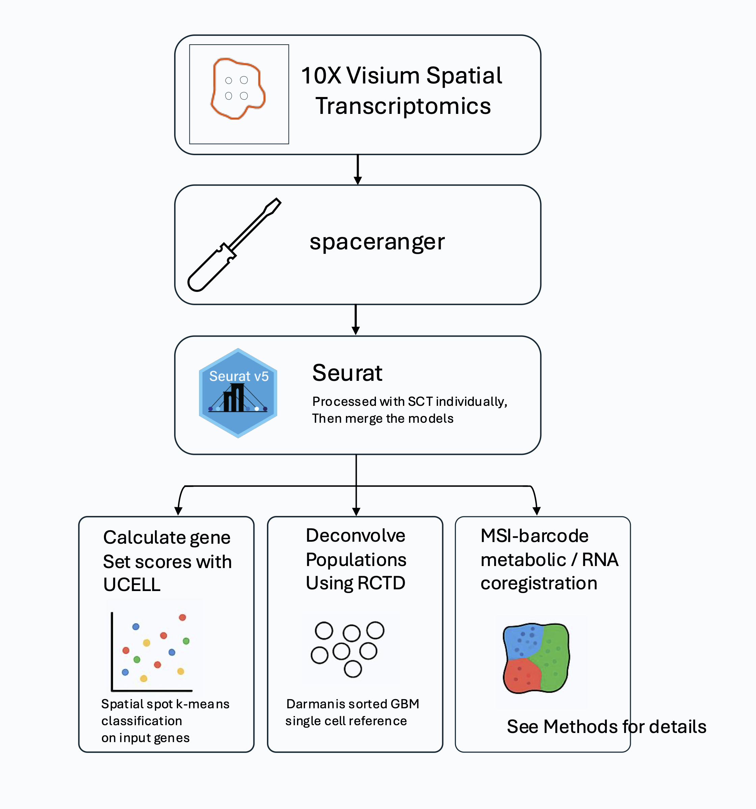

# 🧠 NatureMetabolism2025_GBM_MetPhenotypes 
Code for Nature Metabolism paper: Cell-intrinsic metabolic phenotypes identified in glioblastoma patients using mass spectrometry imaging of 13C-labeled glucose metabolism. The MSI registration is not included in this github. See Methods of the paper.

## 🎯 Project Summary

We investigated metabolic heterogeneity in GBM using integrated metabolomics and transcriptomics data. This repository includes scripts for data preprocessing, clustering analyses, visualization, and figure generation.

## 📁 Repository Structure

## ⚙️ Main Workflow

## 💻 Dependencies

See full session information and package versions here: [sessionInfo.txt](sessionInfo/sessionInfo.txt)
